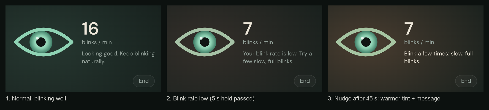

# Eye Strain Monitor

**Live app:** https://andrewjounkim.github.io/eyestrain-monitor/
**Prompt log:** [prompt_log.md](prompt_log.md)

> Desktop-first: it needs a webcam, and the floating widget needs Chrome or Edge on a computer. On a phone the layout still works, but it isn't the intended use.

<!-- ============================================================
     The sections below must be written by Andrew in his own words
     (course requirement). Replace each TODO line.
     ============================================================ -->

## What it does

TODO (Andrew, own words): what the app does and who it's for, in a few sentences.

## How to use it

TODO (Andrew, own words): the steps a first-time user takes, e.g. click the eye, Start monitoring, calibration, the pop-out widget, End session, History.

## Features I'm most proud of

TODO (Andrew, own words): 2–4 features and why. Screenshots you can use are in [docs/screenshots/](docs/screenshots/), e.g.



## How to run it locally

TODO (Andrew, own words): short version. Exact commands are in the AI-generated section at the bottom.

## Secrets

TODO (Andrew, own words): there are no API keys or secrets. Say why (everything runs in the browser, the face model is downloaded from Google's public model storage at build time, and nothing is sent to a server).

## How I used AI

TODO (Andrew, own words): a short summary of how you used AI, plus citations. At minimum:
- Claude Code (Claude Opus 5.5, Anthropic) wrote a substantial portion of the code.
- MediaPipe Face Landmarker (`@mediapipe/tasks-vision`, Google) is the face model.
- Fonts: Fraunces and DM Sans (via Fontsource).

The full prompt history is in [prompt_log.md](prompt_log.md).

---

## AI-generated documentation

*Everything below this line was written by Claude (Claude Code, Claude Opus 5.5) as a technical reference.*

### Run locally

Requires Node.js 20.19+ (or 22+) and Chrome or Edge.

```bash
cd client
npm install      # also copies MediaPipe's wasm files and downloads the face model (postinstall)
npm run dev      # http://localhost:5173 (hot reload)

# production build, closest to the deployed site:
npm run build
npm run preview  # http://localhost:4173
```

If `client/public/mediapipe/` is missing after installing, run `npm run postinstall`.
Camera access only works on `https://` or `localhost`.

### Deployment

The site is hosted on GitHub Pages from the `gh-pages` branch. To publish the current code:

```bash
cd client
npm run deploy   # runs scripts/deploy-pages.sh
```

GitHub Pages serves project sites from a subfolder, so the deploy build runs with `BASE_PATH=/eyestrain-monitor/`, and every app URL (MediaPipe files, icons, manifest, service-worker scope) is derived from that base path. Local `npm run dev` / `npm run build` still use `/`.

### How data flows

```
camera.js (getUserMedia)
  ├─ worker mode:  detector-worker.js ─(MediaStreamTrackProcessor, transferred stream)─> worker.js
  └─ fallback:     detector-main.js (requestVideoFrameCallback on the <video>)
        └─ both run MediaPipe FaceLandmarker, then frame-processor.js:
             ear.js (eye aspect ratio) + blink.js (calibration, blinks, full/incomplete)
             pose.js (gaze, head position, distance from iris size) + lighting.js
        └─ 'result' / 'stats' messages ─> main.js
             ├─ ui.js, graph.js           live numbers, EAR graph
             ├─ comfort.js, nudge.js      calm good/fair/act state, in-app nudges
             ├─ widget.js                 floating always-on-top window (Document Picture-in-Picture)
             ├─ session.js                stats for the current session -> summary-view.js
             ├─ history.js                saved session summaries (localStorage) -> history-view.js
             └─ diagnostics.js            fps while visible vs hidden (Page Visibility API)
```

Detection runs in a module **Web Worker** fed by a stream of camera frames. Browsers pause `requestAnimationFrame` in hidden tabs and minimized windows, but the worker keeps processing frames. In testing it kept ~20 fps while the tab was hidden, against 0 fps for the main-thread version (the Diagnostics page measures this).

### Files (`client/src`)

| File | Role |
|---|---|
| `config.js` | Every tunable threshold, with comments |
| `main.js` | Wires everything together |
| `camera.js` | Webcam access and friendly error messages |
| `landmarker.js` | Creates the FaceLandmarker (GPU, falls back to CPU) |
| `detector-worker.js`, `worker.js` | Worker-mode detection (camera frames → worker) |
| `detector-main.js` | Main-thread fallback / control for the experiment |
| `frame-processor.js` | Per-frame logic shared by both detectors |
| `ear.js`, `blink.js`, `pose.js`, `lighting.js` | Measurements (pure functions, no DOM) |
| `comfort.js`, `nudge.js` | Comfort state with a hold time; in-app nudges |
| `session.js`, `summary-view.js` | Session statistics and the end-of-session summary |
| `history.js`, `history-view.js` | Saved sessions (this browser only) and the trend chart |
| `widget.js` | Floating live-eye widget |
| `intro.js`, `views.js`, `ui.js`, `graph.js`, `diagnostics.js` | Intro animation, page switching, DOM updates, charts, diagnostics |
| `notifications.js`, `sw.js` | Notification test and the service worker (offline caching, notification clicks) |

### Privacy

Video frames never leave the device. Only numbers (blink counts, rates, durations) are stored, in the browser's localStorage.
